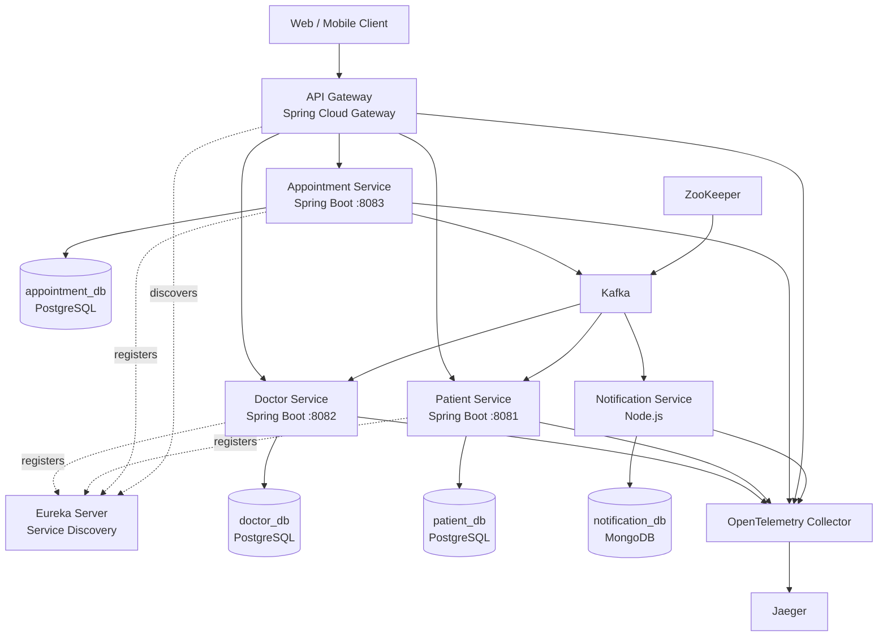

# Hospital Management System — Spring Boot Microservices

## 🏛️ Architecture Overview

```text
                              ┌──────────────────────┐
                              │      Client / UI     │
                              └──────────┬───────────┘
                                         │
                                      HTTP :8080
                                         │
                                         ▼
                              ┌──────────────────────┐
                              │     API Gateway      │
                              │ Spring Cloud Gateway │
                              │        :8080         │
                              └──────────┬───────────┘
                                         │
                    ┌────────────────────┼────────────────────┐
                    │                    │                    │
                    ▼                    ▼                    ▼
          ┌──────────────────┐  ┌──────────────────┐  ┌──────────────────┐
          │ Appointment      │  │ Patient Service  │  │ Doctor Service   │
          │ Service          │  │     :8081        │  │     :8082        │
          │     :8083        │  └────────┬─────────┘  └────────┬─────────┘
          └────────┬─────────┘           │                     │
                   │                     ▼                     ▼
                   │              ┌──────────────┐      ┌──────────────┐
                   │              │  patient_db  │      │  doctor_db   │
                   │              │  PostgreSQL  │      │  PostgreSQL  │
                   │              └──────────────┘      └──────────────┘
                   │
                   ▼
          ┌───────────────────┐
          │   appointment_db  │
          │    PostgreSQL     │
          └─────────┬─────────┘
                    │
                    │ Transactional Outbox
                    ▼
          ┌──────────────────────────┐
          │         Apache Kafka     │
          │  Saga / Event Messaging  │
          └────────────┬─────────────┘
                       │
                       │ Appointment Events
                       ▼
          ┌──────────────────────────┐
          │   Notification Service   │
          │        Node.js           │
          │          :8084           │
          └────────────┬─────────────┘
                       │
                       ▼
                ┌──────────────┐
                │   MongoDB    │
                │ notification │
                │    _db       │
                └──────────────┘


                    ┌──────────────────────┐
                    │    Eureka Server     │
                    │ Service Discovery    │
                    │       :8761          │
                    └──────────────────────┘
                       ▲       ▲       ▲
                       │       │       │
                    Gateway  Doctor  Patient
                             Appointment
```

### Request Flow

```text
Client
  │
  ▼
API Gateway :8080
  │
  ├──────────────► Patient Service :8081
  │
  ├──────────────► Doctor Service :8082
  │
  └──────────────► Appointment Service :8083
```

### Appointment Booking Flow

```text
Client
   │
   ▼
API Gateway
   │
   ▼
Appointment Service
   │
   ├──── Validate Patient ────► Patient Service
   │
   ├──── Reserve Doctor Slot ─► Doctor Service
   │
   ▼
Appointment DB
   │
   ├──── appointments
   │
   └──── outbox_events
              │
              ▼
            Kafka
              │
              ▼
      Notification Service :8084
              │
              ▼
            MongoDB
```

### Event-Driven Flow

```text
Appointment Service
        │
        ▼
  Transactional Outbox
        │
        ▼
      Kafka
        │
        ├──────────────► Notification Service
        │
        ├──────────────► Audit Service
        │
        └──────────────► Other Consumers
```

### Service Ports

```dotenv
# API
API_GATEWAY_PORT=8080

# Spring Boot Microservices
PATIENT_SERVICE_PORT=8081
DOCTOR_SERVICE_PORT=8082
APPOINTMENT_SERVICE_PORT=8083

# Node.js
NOTIFICATION_SERVICE_PORT=8084

# Service Discovery
EUREKA_PORT=8761

# Infrastructure
POSTGRES_PORT=5432
MONGODB_PORT=27017
KAFKA_PORT=9092
ZOOKEEPER_PORT=2181
```

### Database Ownership

```text
Patient Service
      │
      ▼
 patient_db
 PostgreSQL

Doctor Service
      │
      ▼
 doctor_db
 PostgreSQL

Appointment Service
      │
      ▼
 appointment_db
 PostgreSQL

Notification Service
      │
      ▼
 notification_db
 MongoDB
```

Each service owns its own database. No microservice directly queries another service's database.

### Communication Model

```text
Synchronous
────────────
API Gateway → Services
Appointment Service → Patient/Doctor validation
Appointment Service → Doctor slot reservation


Asynchronous
────────────
Appointment Service
        ↓
Transactional Outbox
        ↓
Kafka
        ↓
Notification Service
```

### Docker Internal Service Names

When services run inside Docker, use Docker Compose service names instead of `localhost`:

```text
PostgreSQL     → postgres:5432
Kafka          → kafka:9092
Eureka         → eureka-server:8761
MongoDB        → mongodb:27017
OTel Collector → otel-collector:4318
```

For example:

```dotenv
PATIENT_DB_URL=jdbc:postgresql://postgres:5432/patient_db
DOCTOR_DB_URL=jdbc:postgresql://postgres:5432/doctor_db
APPOINTMENT_DB_URL=jdbc:postgresql://postgres:5432/appointment_db

KAFKA_BOOTSTRAP_SERVER=kafka:9092

EUREKA_URL=http://eureka-server:8761/eureka/

MONGO_URI=mongodb://mongodb:27017/notification_db
```

`localhost` should only be used when the application itself is running directly on the host machine rather than inside Docker.

A production-oriented hospital management system built with **Spring Boot microservices**, **API Gateway**, **Eureka Service Discovery**, **Kafka**, **PostgreSQL**, and a **Node.js + MongoDB Notification Service**.

The current services are:

- Doctor Service — Spring Boot
- Patient Service — Spring Boot
- Appointment Service — Spring Boot
- Notification Service — Node.js + MongoDB
- API Gateway — Spring Cloud Gateway
- Eureka Server — Service Discovery
- PostgreSQL — transactional data
- Kafka + ZooKeeper — event-driven communication
- OpenTelemetry Collector + Jaeger — observability

---

## Architecture



---

## High-level service ownership

Each business service owns its own database.

```text
Patient Service
    |
    +---- patient_db

Doctor Service
    |
    +---- doctor_db

Appointment Service
    |
    +---- appointment_db

Notification Service
    |
    +---- notification_db
```

### Database-per-service rule

A service must never directly query another service's database.

For example:

```text
Appointment Service
        |
        X  SELECT from patient_db
        X  SELECT from doctor_db
```

Instead:

```text
Appointment Service
        |
        +---- Patient Service
        |
        +---- Doctor Service
```

PostgreSQL may run in one Docker container during development, but the databases remain logically separated:

```text
PostgreSQL
├── patient_db
├── doctor_db
└── appointment_db
```

---

# Technology Stack

| Component | Technology |
|---|---|
| Language | Java 25 |
| Spring Boot | 4.1.0 |
| Build | Maven |
| API Gateway | Spring Cloud Gateway |
| Service Discovery | Eureka |
| Doctor Service | Spring Boot + JPA |
| Patient Service | Spring Boot + JPA |
| Appointment Service | Spring Boot + JPA |
| Database | PostgreSQL 18 |
| Migration | Flyway |
| Messaging | Apache Kafka / Confluent Kafka |
| Kafka Coordination | ZooKeeper |
| Notification Service | Node.js |
| Notification Database | MongoDB |
| Observability | OpenTelemetry + Jaeger |
| Containerization | Docker / Docker Compose |

---

# Repository Structure

```text
Hospital-Management-Spring-Boot/
│
├── docker-compose.yml
│
├── .env.local
├── .env.dev
├── .env.prod
├── .gitignore
│
├── services/
│   │
│   ├── api-gateway/
│   │
│   ├── eureka-server/
│   │
│   ├── doctor-service/
│   │
│   ├── patient-service/
│   │
│   ├── appointment-service/
│   │
│   └── notification-service/
│
├── infrastructure/
│   ├── kafka/
│   ├── postgres/
│   ├── mongodb/
│   └── observability/
│
└── docs/
```

Adjust the folder names if your repository uses a slightly different structure.

---

# Environment Configuration

There are three environment files:

```text
.env.local
.env.dev
.env.prod
```

Docker Compose does **not** automatically load `.env.dev`, `.env.local`, or `.env.prod`.

Always select the environment explicitly:

```bash
docker compose --env-file .env.dev ...
```

## `.env.dev`

For the current Docker-based development environment, service-to-service addresses must use Docker service names.

Example:

```dotenv
PATIENT_SERVICE_PORT=8081
DOCTOR_SERVICE_PORT=8082
APPOINTMENT_SERVICE_PORT=8083
API_GATEWAY_PORT=8080
EUREKA_PORT=8761

EUREKA_URL=http://eureka-server:8761/eureka/

DB_USERNAME=postgres
DB_PASSWORD=postgres

PATIENT_DB=patient_db
DOCTOR_DB=doctor_db
APPOINTMENT_DB=appointment_db

POSTGRES_PORT=5432

PATIENT_DB_URL=jdbc:postgresql://postgres:5432/patient_db
DOCTOR_DB_URL=jdbc:postgresql://postgres:5432/doctor_db
APPOINTMENT_DB_URL=jdbc:postgresql://postgres:5432/appointment_db

KAFKA_BOOTSTRAP_SERVER=kafka:9092

MONGO_URI=mongodb://mongodb:27017/notification_db

OTEL_ENDPOINT=http://otel-collector:4318/v1/traces
OTEL_METRICS_ENDPOINT=http://otel-collector:4318/v1/metrics
```

Use the exact variable names expected by `docker-compose.yml`.

## `.env.local`

Use `.env.local` when running supporting infrastructure with Docker but running one or more Spring Boot applications directly on the host machine.

Typical host addresses are:

```dotenv
EUREKA_URL=http://localhost:8761/eureka/
PATIENT_DB_URL=jdbc:postgresql://localhost:5432/patient_db
DOCTOR_DB_URL=jdbc:postgresql://localhost:5432/doctor_db
APPOINTMENT_DB_URL=jdbc:postgresql://localhost:5432/appointment_db
KAFKA_BOOTSTRAP_SERVER=localhost:9092
MONGO_URI=mongodb://localhost:27017/notification_db
```

Do not use this file for container-to-container addresses.

## `.env.prod`

Production values must come from your deployment environment or secret management system.

Example structure:

```dotenv
PATIENT_SERVICE_PORT=8081
DOCTOR_SERVICE_PORT=8082
APPOINTMENT_SERVICE_PORT=8083
API_GATEWAY_PORT=8080
EUREKA_PORT=8761

EUREKA_URL=http://eureka-server:8761/eureka/

DB_USERNAME=CHANGE_ME
DB_PASSWORD=CHANGE_ME

PATIENT_DB=patient_db
DOCTOR_DB=doctor_db
APPOINTMENT_DB=appointment_db

POSTGRES_PORT=5432

PATIENT_DB_URL=jdbc:postgresql://postgres:5432/patient_db
DOCTOR_DB_URL=jdbc:postgresql://postgres:5432/doctor_db
APPOINTMENT_DB_URL=jdbc:postgresql://postgres:5432/appointment_db

KAFKA_BOOTSTRAP_SERVER=kafka:9092

MONGO_URI=mongodb://mongodb:27017/notification_db

OTEL_ENDPOINT=http://otel-collector:4318/v1/traces
OTEL_METRICS_ENDPOINT=http://otel-collector:4318/v1/metrics
```

Do not commit real production credentials into Git.

For production, use Docker secrets, Kubernetes Secrets, Vault, AWS Secrets Manager, GCP Secret Manager, Azure Key Vault, or an equivalent secret-management solution.

---

# Docker Networking Rule

This is one of the most important rules in this project.

When Spring Boot is running **inside Docker**:

```text
PostgreSQL     = postgres:5432
Kafka          = kafka:9092
Eureka         = eureka-server:8761
MongoDB        = mongodb:27017
OTel Collector = otel-collector:4318
```

Do NOT use:

```text
localhost:5432
localhost:9092
localhost:8761
localhost:27017
```

from inside a container.

Inside a container:

```text
localhost
```

means **that same container**.

---

# Prerequisites

Install:

- Docker Desktop
- Docker Compose
- Java 25 (only required when running Spring Boot outside Docker)
- Maven (only required when running Spring Boot outside Docker)
- Node.js/npm (only required when running Notification Service outside Docker)

Check Docker:

```bash
docker --version
docker compose version
```

Check Java:

```bash
java -version
```

Check Maven:

```bash
mvn -version
```

Check Node:

```bash
node --version
npm --version
```

---

# First-time Setup

## 1. Clone the repository

```bash
git clone <repository-url>
cd Hospital-Management-Spring-Boot
```

---

## 2. Check the environment file

Make sure the environment files are in the repository root:

```text
Hospital-Management-Spring-Boot/
├── .env.local
├── .env.dev
├── .env.prod
└── docker-compose.yml
```

Verify:

```bash
ls -la .env*
```

---

## 3. Validate Docker Compose configuration

Before starting anything:

```bash
docker compose --env-file .env.dev config
```

This should complete without errors such as:

```text
variable ... is not set
required variable ... is missing a value
```

This is the recommended first check whenever `.env.dev` or `docker-compose.yml` changes.

---

# Start the Full System with Docker

Use:

```bash
docker compose --env-file .env.dev up -d --build
```

This builds and starts all services.

Check containers:

```bash
docker compose --env-file .env.dev ps
```

Or:

```bash
docker ps
```

---

# Stop the System

```bash
docker compose --env-file .env.dev down
```

This removes containers and networks but does not normally remove named volumes.

---

# Stop and Remove Volumes

Only use this if you intentionally want to delete local database data:

```bash
docker compose --env-file .env.dev down -v
```

WARNING: this can delete local PostgreSQL/MongoDB data stored in Docker volumes.

Do not use it against production data.

---

# Rebuild One Service

For example, Appointment Service:

```bash
docker compose --env-file .env.dev build --no-cache appointment-service
```

Then:

```bash
docker compose --env-file .env.dev up -d appointment-service
```

Notification Service:

```bash
docker compose --env-file .env.dev build --no-cache notification-service
```

---

# View Logs

Appointment Service:

```bash
docker logs -f hospital-appointment-service
```

Doctor Service:

```bash
docker logs -f hospital-doctor-service
```

Patient Service:

```bash
docker logs -f hospital-patient-service
```

Notification Service:

```bash
docker logs -f hospital-notification-service
```

Gateway:

```bash
docker logs -f hospital-api-gateway
```

Eureka:

```bash
docker logs -f hospital-eureka
```

---

# Core Ports

Current development ports:

```text
API Gateway          8080
Patient Service      8081
Doctor Service       8082
Appointment Service  8083
Eureka Server        8761
PostgreSQL           5432
Kafka                9092
MongoDB              27017
```

The public client should normally use the API Gateway:

```text
http://localhost:8080
```

Do not expose internal service APIs to clients unless there is a specific requirement.

---

# API Gateway

Typical routes:

```text
GET/POST/... /api/patients/**
    ↓
patient-service

GET/POST/... /api/doctors/**
    ↓
doctor-service

GET/POST/... /api/appointments/**
    ↓
appointment-service
```

Client request example:

```bash
curl http://localhost:8080/api/patients
```

---

# Eureka

Open:

```text
http://localhost:8761
```

The dashboard should show services registered with Eureka.

Expected applications include:

```text
PATIENT-SERVICE
DOCTOR-SERVICE
APPOINTMENT-SERVICE
API-GATEWAY
```

The exact list depends on which services are enabled in the current environment.

---

# PostgreSQL

The development PostgreSQL instance contains separate databases:

```text
patient_db
doctor_db
appointment_db
```

Connect to Patient DB:

```bash
docker exec -it hospital-postgres \
  psql -U postgres -d patient_db
```

Connect to Doctor DB:

```bash
docker exec -it hospital-postgres \
  psql -U postgres -d doctor_db
```

Connect to Appointment DB:

```bash
docker exec -it hospital-postgres \
  psql -U postgres -d appointment_db
```

List tables:

```sql
\dt
```

---

# Flyway

Database schemas are managed by **Flyway**.

Hibernate should validate the schema:

```yaml
spring:
  jpa:
    hibernate:
      ddl-auto: validate
```

Do not use:

```yaml
ddl-auto: update
```

for the production configuration.

Migration structure:

```text
src/main/resources/db/migration/
├── V1__create_appointments_table.sql
├── V2__create_outbox_events_table.sql
├── V3__add_outbox_processing_fields.sql
└── V4__create_appointment_booking_saga.sql
```

Never edit an already-applied migration in a shared/production environment.

Create a new migration instead:

```text
V5__...
V6__...
```

---

# Appointment Booking Architecture

Appointment Service owns the appointment data.

```text
Client
  |
  v
API Gateway
  |
  v
Appointment Service
  |
  +---- Patient Service
  |
  +---- Doctor Service
  |
  v
appointment_db
```

The appointment record contains references:

```text
patient_id
doctor_id
appointment_time
status
```

The complete Patient/Doctor entities are not duplicated into the main appointment table.

---

# Appointment Booking Requirements

The booking workflow must guarantee:

1. Patient exists.
2. Doctor exists.
3. Doctor is available at the requested time.
4. Appointment is confirmed only after required validation/reservation succeeds.
5. Two patients cannot reserve the same doctor at the same appointment time.
6. Appointment and its outbox event are committed atomically.

---

# Prevent Double Booking

The Appointment database uses database-level protection in addition to application logic.

Example:

```sql
CREATE UNIQUE INDEX uk_active_doctor_appointment_time
ON appointments (doctor_id, appointment_time)
WHERE status IN (
    'PENDING',
    'SCHEDULED',
    'CONFIRMED'
);
```

The database is the final protection against concurrent requests.

A duplicate booking should result in:

```text
HTTP 409 CONFLICT
```

---

# Transactional Outbox

Appointment events are not written directly to Kafka inside the booking transaction.

The flow is:

```text
Appointment Booking
       |
       v
PostgreSQL transaction
       |
       +---- appointments
       |
       +---- outbox_events
                |
                v
          Outbox Publisher
                |
                v
              Kafka
```

Example outbox record:

```text
aggregate_type  = APPOINTMENT
aggregate_id    = 10
event_type      = APPOINTMENT_CREATED
payload         = JSON
published_at    = NULL
```

After successful publication:

```text
processing_status = PUBLISHED
published_at      = <timestamp>
```

This avoids the database/Kafka dual-write problem.

---

# Kafka

Kafka is used for asynchronous, event-driven communication.

Current appointment topic:

```text
appointment.events
```

Check topics:

```bash
docker exec hospital-kafka \
  /opt/kafka/bin/kafka-topics.sh \
  --bootstrap-server kafka:9092 \
  --list
```

Describe the appointment topic:

```bash
docker exec hospital-kafka \
  /opt/kafka/bin/kafka-topics.sh \
  --bootstrap-server kafka:9092 \
  --describe \
  --topic appointment.events
```

For the current single-broker development environment:

```text
Partitions: 3
Replication factor: 1
```

Production should use multiple Kafka brokers and appropriate replication.

---

# Read the Appointment Kafka Topic

Use:

```bash
docker exec hospital-kafka \
  /opt/kafka/bin/kafka-console-consumer.sh \
  --bootstrap-server kafka:9092 \
  --topic appointment.events \
  --from-beginning
```

If the topic is empty, the command may wait or eventually report a timeout.

That does not necessarily indicate a Kafka failure.

---

# Appointment Event

The current appointment creation event is conceptually:

```json
{
  "appointmentId": 10,
  "patientId": 2,
  "doctorId": 15,
  "appointmentTime": "2026-09-01T10:30:00",
  "status": "CONFIRMED"
}
```

The exact status depends on where the event is published in the booking workflow.

---

# Notification Service

Notification Service is implemented using:

```text
Node.js
MongoDB
Kafka
Saga pattern
```

Its responsibility is to consume appointment events and perform notification-related work.

Architecture:

```text
Appointment Service
       |
       v
appointment.events
       |
       v
Kafka
       |
       v
Notification Service
       |
       +---- MongoDB
       |
       +---- notification processing
```

The Notification Service should not directly query:

```text
patient_db
doctor_db
appointment_db
```

It consumes the information it needs from Kafka events or calls a service API only when authoritative current data is explicitly required.

---

# Notification Saga

The notification flow can be modeled with a Saga-style workflow.

Example:

```text
AppointmentCreated
       |
       v
Notification Saga
       |
       +---- create notification
       |
       +---- send notification
       |
       +---- record result
       |
       v
NotificationCompleted
```

For failures:

```text
AppointmentCreated
       |
       v
Send Notification
       |
       X
       |
       v
Retry / Failed state
```

Notification failures should not normally cancel an already-confirmed appointment.

This is an important business distinction:

```text
Appointment booking
    =
critical business transaction

Notification
    =
asynchronous side effect
```

---

# Kafka Consumer Groups

Use separate consumer groups for independent consumers.

Example:

```text
appointment.events
       |
       +---- notification-service
       |       group:
       |       notification-service-group
       |
       +---- audit-service
               group:
               audit-service-group
```

Different consumer groups allow both services to receive the same event independently.

Multiple instances of the same service should normally use the same consumer group.

---

# Idempotency

Kafka delivery is designed around at-least-once processing in the overall architecture.

Consumers must therefore tolerate duplicate events.

Use a unique event identifier:

```text
event-id
```

and store/process it idempotently.

Conceptually:

```text
Kafka event
   |
   v
Check event-id
   |
   +---- already processed → ignore
   |
   +---- new event → process
```

Do not assume that a Kafka consumer will see each event exactly once at the application level.

---

# Running Notification Service Separately

To run Notification Service locally:

```bash
cd services/notification-service
npm install
npm run build
npm start
```

The Node.js application must be configured to reach:

```text
Kafka:
localhost:9092

MongoDB:
localhost:27017
```

when it runs directly on the host.

When it runs in Docker, use:

```text
Kafka:
kafka:9092

MongoDB:
mongodb:27017
```

---

# Typical Development Startup

Recommended sequence:

## 1. Validate environment

```bash
docker compose --env-file .env.dev config
```

## 2. Start infrastructure and services

```bash
docker compose --env-file .env.dev up -d --build
```

## 3. Check containers

```bash
docker compose --env-file .env.dev ps
```

## 4. Check Eureka

Open:

```text
http://localhost:8761
```

## 5. Check Gateway

```bash
curl -i http://localhost:8080/actuator/health
```

## 6. Test Patient API

```bash
curl -i http://localhost:8080/api/patients
```

## 7. Test Doctor API

```bash
curl -i http://localhost:8080/api/doctors
```

## 8. Test Appointment API

```bash
curl -i http://localhost:8080/api/appointments
```

The exact endpoints depend on the controllers currently implemented.

---

# Example Appointment Booking

Example request:

```http
POST /api/appointments
Content-Type: application/json
```

```json
{
  "patientId": 2,
  "doctorId": 15,
  "appointmentTime": "2026-09-01T10:30:00"
}
```

Successful result:

```json
{
  "success": true,
  "message": "Appointment booked successfully",
  "data": {
    "appointmentId": 10,
    "patientId": 2,
    "doctorId": 15,
    "appointmentTime": "2026-09-01T10:30:00",
    "status": "CONFIRMED"
  }
}
```

Duplicate doctor/time:

```text
HTTP 409 CONFLICT
```

---

# Observability

The platform includes:

```text
Microservices
     |
     v
OpenTelemetry
     |
     v
OTel Collector
     |
     v
Jaeger
```

Open Jaeger:

```text
http://localhost:16686
```

The service logs include trace/span information when tracing is active.

### Important Docker rule

Do not configure a containerized service to send telemetry to:

```text
localhost:4318
```

Use:

```text
otel-collector:4318
```

inside Docker.

---

# Common Problems

## 503 from API Gateway

Example:

```json
{
  "status": 503,
  "error": "Service Unavailable"
}
```

Check:

```bash
docker ps
docker logs hospital-patient-service --tail 100
docker logs hospital-api-gateway --tail 100
```

Then verify Eureka contains:

```text
PATIENT-SERVICE
```

A common cause is the target service being down.

---

## Connection to `localhost:5432` refused

If the service runs in Docker and the error says:

```text
Connection to localhost:5432 refused
```

change:

```text
jdbc:postgresql://localhost:5432/...
```

to:

```text
jdbc:postgresql://postgres:5432/...
```

---

## Kafka `UNKNOWN_TOPIC_OR_PARTITION`

Check the topic:

```bash
docker exec hospital-kafka \
  /opt/kafka/bin/kafka-topics.sh \
  --bootstrap-server kafka:9092 \
  --list
```

If `appointment.events` is missing, create it for the development broker:

```bash
docker exec hospital-kafka \
  /opt/kafka/bin/kafka-topics.sh \
  --bootstrap-server kafka:9092 \
  --create \
  --topic appointment.events \
  --partitions 3 \
  --replication-factor 1
```

---

## Kafka consumer shows `Processed a total of 0 messages`

This can simply mean the topic contains no messages.

Check the producer/outbox first.

For Appointment Service:

```bash
docker exec -it hospital-postgres \
  psql -U postgres -d appointment_db
```

```sql
SELECT
    id,
    aggregate_id,
    event_type,
    processing_status,
    attempt_count,
    published_at,
    last_error
FROM outbox_events
ORDER BY created_at DESC
LIMIT 10;
```

---

## Flyway says migrations are up to date but tables are missing

Check the correct database:

```bash
docker exec -it hospital-postgres \
  psql -U postgres -d appointment_db
```

Then:

```sql
\dt
```

And:

```sql
SELECT *
FROM flyway_schema_history
ORDER BY installed_rank;
```

Make sure the service's datasource URL points to the expected database.

---

# Production Principles

The project follows these rules:

```text
✅ Database per service
✅ Flyway migrations
✅ Hibernate ddl-auto = validate
✅ No cross-service database access
✅ Kafka for asynchronous events
✅ Transactional Outbox for reliable event publishing
✅ Idempotent Kafka consumers
✅ Saga for multi-step business workflows where compensation is required
✅ API Gateway as the external entry point
✅ Eureka for service discovery
✅ OpenTelemetry for tracing/metrics
✅ PostgreSQL for transactional business data
✅ MongoDB where document storage is appropriate
✅ Environment-based configuration
✅ Secrets separated from source control
✅ Dockerized services
```

Avoid:

```text
❌ Shared business database
❌ Cross-service SQL queries
❌ Hibernate ddl-auto=update in production
❌ Publishing critical events directly after save without an outbox
❌ Assuming Kafka delivers exactly once to application logic
❌ Using localhost for container-to-container communication
❌ Hard-coded production passwords
```

---

# Git Ignore

At minimum:

```gitignore
.env
.env.local
.env.dev
.env.prod

target/
node_modules/

*.log

.idea/
.vscode/
.DS_Store
```

If environment files contain only non-secret defaults and you intentionally want to commit them, use a separate template instead:

```text
.env.example
```

and keep actual credentials outside Git.

---

# Environment Selection Cheat Sheet

### Development with Docker

```bash
docker compose --env-file .env.dev up -d --build
```

### Stop development

```bash
docker compose --env-file .env.dev down
```

### Local infrastructure + host applications

```bash
docker compose --env-file .env.local up -d
```

Then run Spring Boot/Node.js directly on the host.

### Production

Use production deployment tooling and secret injection rather than treating `.env.prod` as a file containing live secrets.

---

# Useful Commands

List containers:

```bash
docker ps
```

View all Compose services:

```bash
docker compose --env-file .env.dev ps
```

Restart one service:

```bash
docker compose --env-file .env.dev restart appointment-service
```

Rebuild one service:

```bash
docker compose --env-file .env.dev build appointment-service
```

Follow logs:

```bash
docker logs -f hospital-appointment-service
```

Validate Compose:

```bash
docker compose --env-file .env.dev config
```

Open PostgreSQL:

```bash
docker exec -it hospital-postgres psql -U postgres -d appointment_db
```

List Kafka topics:

```bash
docker exec hospital-kafka \
  /opt/kafka/bin/kafka-topics.sh \
  --bootstrap-server kafka:9092 \
  --list
```

---

# Current Event-Driven Flow

The current target architecture is:

```text
                         Client
                           |
                           v
                     API Gateway
                           |
                           v
                  Appointment Service
                           |
                  +--------+--------+
                  |                 |
                  v                 v
             PostgreSQL          Outbox
                                   |
                                   v
                              Kafka
                                   |
                  +----------------+----------------+
                  |                                 |
                  v                                 v
          Notification Service               Other Consumers
                  |
                  v
               MongoDB
```

For booking validation/reservation:

```text
Appointment Service
      |
      +---- Patient Service
      |
      +---- Doctor Service
             |
             +---- atomic slot reservation
```

For appointment details/read models:

```text
Doctor Service --------\
                         \
                          > Kafka --> Appointment read model
                         /
Patient Service --------/
```

This keeps service ownership clear while allowing scalable, asynchronous event-driven communication.
